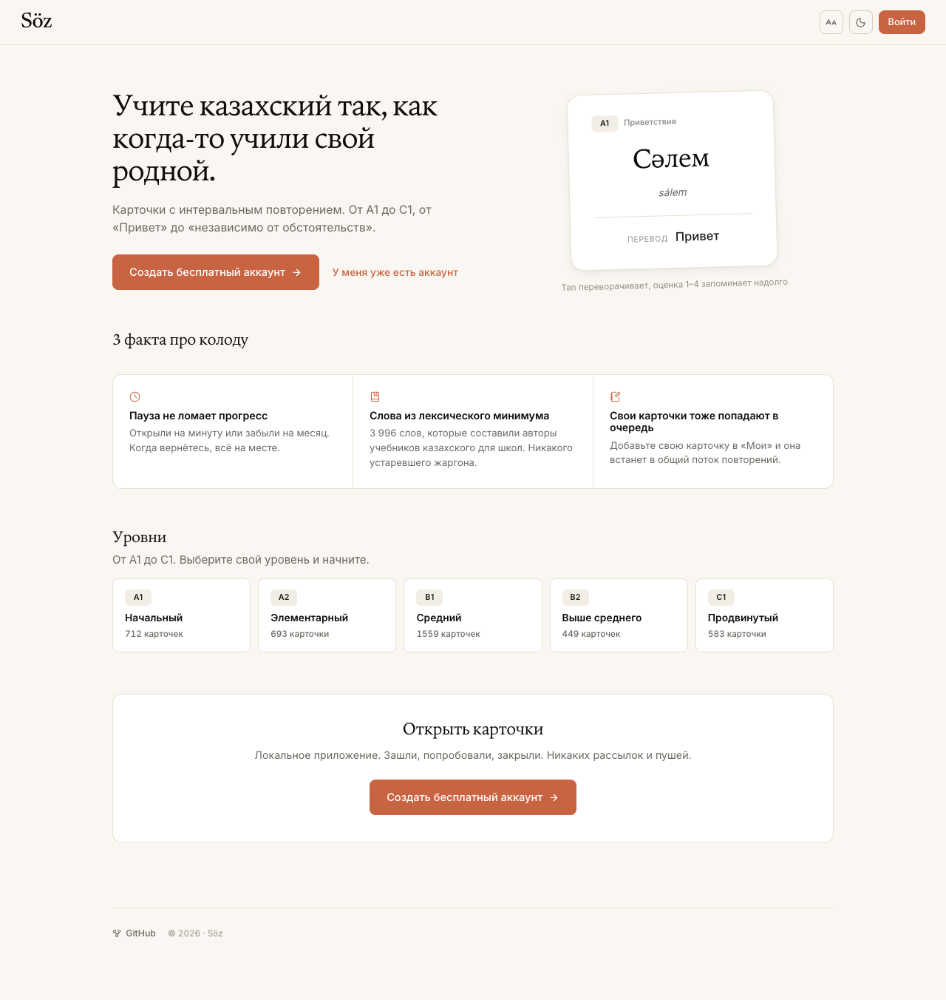
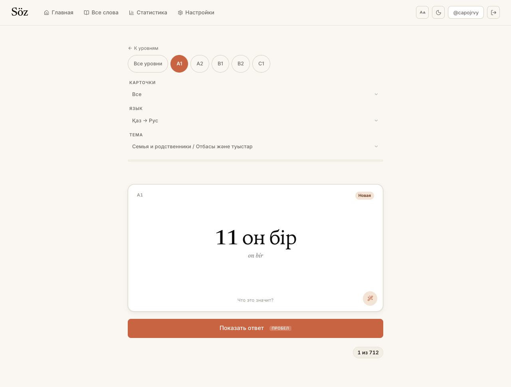
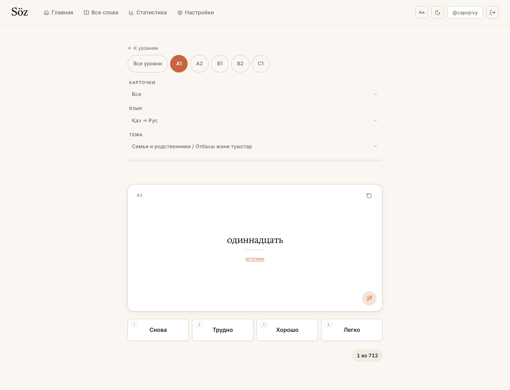
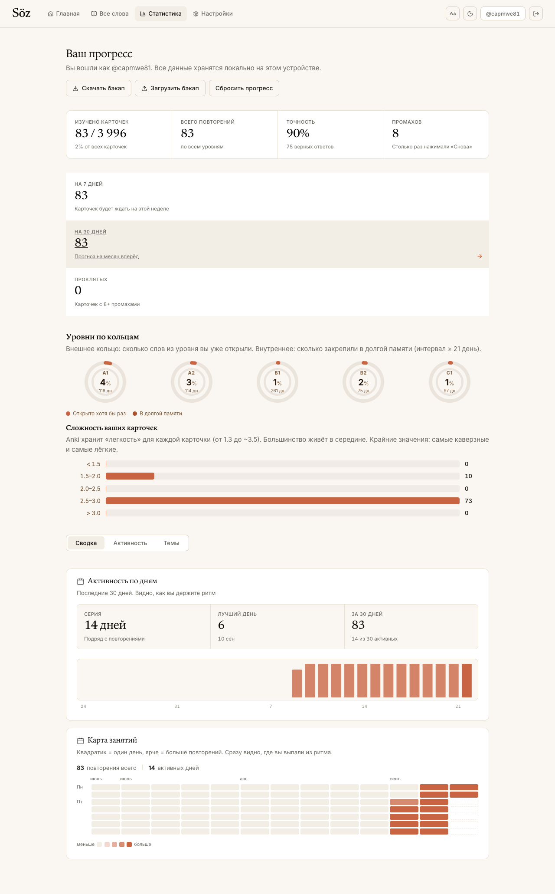

# Қазақ Anki — Spaced-Repetition Flashcards for Kazakh

A free, local-first web app for learning **Қазақ тілі** (Kazakh) with **Anki-style spaced repetition**. 3,996 words across the five CEFR levels A1, A2, B1, B2, C1.

> Modern TypeScript stack · React 19 · Vite 6 · SM-2 algorithm · bcrypt auth · localStorage · 110 KB gzipped.

---

## Features

- **3,996 words** organized by CEFR level (A1 → C1) and topic. Sourced from the public [Wordmastery 1000-most-common-Kazakh-words](https://wordmastery.org/kazakh/) list and the official school lexicon (Жұмбақтары / etc.).
- **SM-2 spaced repetition** with four rating buttons: *Again / Hard / Good / Easy*, plus keyboard shortcuts (1/2/3/4 and Space).
- **Per-user accounts** with bcrypt-hashed passwords. Each username is its own data island.
- **No server.** Your study progress, account and theme live in `localStorage`. Nothing is sent anywhere.
- **Light + dark theme**, responsive, accessible (keyboard, reduced-motion, focus styles).
- **Browse every card** with search and level filters.
- **Stats page** with accuracy, mastery, level mastery rings and per-topic progress.
- **Deployed with `npm run deploy`** — pushes `dist/` to a `gh-pages` branch on GitHub Pages.

---

## Screenshots








The full gallery (mobile, dark mode, every route) lives in
[`docs/screenshots/`](docs/screenshots/README.md).

---

## Quick start

```bash
npm install
npm run dev        # http://localhost:5173/anki-qazaq/
```

Build for production:

```bash
npm run build      # → dist/
npm run preview    # serve dist/ locally
npm run deploy     # build + push dist/ to gh-pages branch
```

---

## Deploying to GitHub Pages

The repo is wired for a project-page deploy at `https://<user>.github.io/anki-qazaq/`.

1. Push this repo to GitHub (default branch: `main` or `master`).
2. In your repo settings → **Pages** → Source: **GitHub Actions** (recommended) or the **`gh-pages` branch** (created by `npm run deploy`).
3. If using the **`gh-pages` branch** flow, just run:

   ```bash
   npm run deploy
   ```

   Builds and pushes `dist/` to a `gh-pages` branch.

4. If using **GitHub Actions**, drop in the workflow below at `.github/workflows/deploy.yml`:

   ```yaml
   name: Deploy to GitHub Pages
   on:
     push:
       branches: [main]
   permissions:
     contents: read
     pages: write
     id-token: write
   jobs:
     build-deploy:
       runs-on: ubuntu-latest
       environment:
         name: github-pages
         url: ${{ steps.deploy.outputs.page_url }}
       steps:
         - uses: actions/checkout@v4
         - uses: actions/setup-node@v4
           with: { node-version: 20, cache: npm }
         - run: npm ci
         - run: npm run build
         - uses: actions/configure-pages@v5
         - uses: actions/upload-pages-artifact@v3
           with: { path: dist }
         - id: deploy
           uses: actions/deploy-pages@v4
   ```

> If you rename the repo, edit `base` in `vite.config.ts` (and any hard-coded links in the README) to match.

### Custom domain

If you serve from a custom domain (apex or subdomain), set `base: '/'` in `vite.config.ts` and add a `CNAME` file in `public/` containing your domain. Then re-deploy.

---

## How learning works

A study session pulls cards that are *due* (interval expired or brand new) from the chosen CEFR level. For each card:

1. The Kazakh word + transliteration shows.
2. Click the card (or press **Space**) to flip and reveal the Russian meaning.
3. Rate yourself: **Again / Hard / Good / Easy** (or `1`/`2`/`3`/`4`).
4. SM-2 schedules the next review — usually in 1 day, 6 days, or `previous × ease`, with the ease factor adjusting to your performance.

Tap **All** in the study tabs to drill every card in the level regardless of due state.

---

## A note on auth

There is no backend. Accounts and progress live in your browser's `localStorage`, keyed by username. Passwords are bcrypt-hashed (8 rounds) on the client before being stored.

This is convenience auth, not security. Anyone with access to your browser profile can read the data. That's the right call for a single-user, local-first learning app on static hosting. Don't put anything sensitive here.

You can reset your progress at any time from the **Stats** page.

---

## Project structure

```
src/
  data/
    decks.json         # 3,996 cards by CEFR level (auto-generated, see below)
    decks.ts           # typed export
  lib/
    sm2.ts             # spaced-repetition algorithm
    auth.ts            # bcrypt registration / login
    storage.ts         # localStorage wrapper + SHA-256 helper
    progress.ts        # per-user progress map
  contexts/
    AuthContext.tsx    # current user
    ProgressContext.tsx# SM-2 grade + totals
    ThemeContext.tsx   # light / dark
  components/
    Layout.tsx         # header / nav / footer
    Flashcard.tsx      # flippable card
    ProtectedRoute.tsx # redirect to /login when signed out
  pages/
    HomePage.tsx       # marketing + dashboard
    LoginPage.tsx
    RegisterPage.tsx
    DecksPage.tsx      # all 5 levels
    StudyPage.tsx      # main study session
    BrowsePage.tsx     # search every card
    StatsPage.tsx      # KPIs + per-level mastery
    NotFoundPage.tsx
  styles/global.css    # design tokens + base
  App.tsx              # router
  main.tsx             # entry
```

### Refreshing the deck data

The cards came from parsing the public Wordmastery PDFs (one per CEFR level). To re-generate:

1. Place the five `A1..C1` PDFs at `/tmp/kazakh-cards/`.
2. Run `python3 /tmp/kazakh-cards/parse_pdfs.py` — it writes `src/data/decks.json`.

Or just edit `decks.json` directly.

---

## Keyboard shortcuts (in study mode)

| Key             | Action                |
|-----------------|-----------------------|
| `Space` / `Enter` | Reveal the answer    |
| `1`             | Again (≤ 1d)          |
| `2`             | Hard                  |
| `3`             | Good                  |
| `4`             | Easy                  |

---

## Credits

- Vocabulary: [Wordmastery.org — 1000 most common Kazakh words (CEFR A1–C1)](https://wordmastery.org/kazakh/), used as an educational source.
- Spaced repetition: SM-2 algorithm (Wozniak, 1990).
- Design tokens: `src/styles/global.css`.

---

## License

MIT — do whatever you want, just don't claim you made it.
