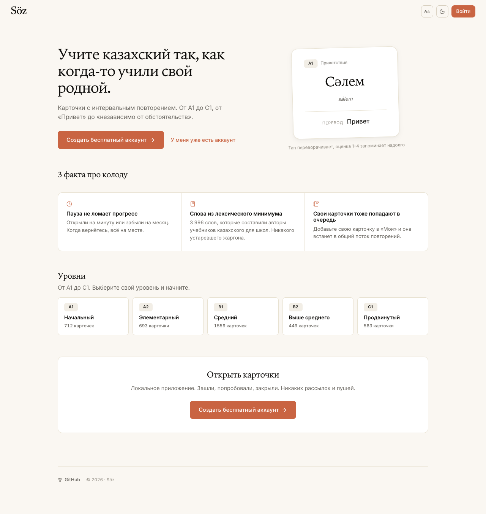
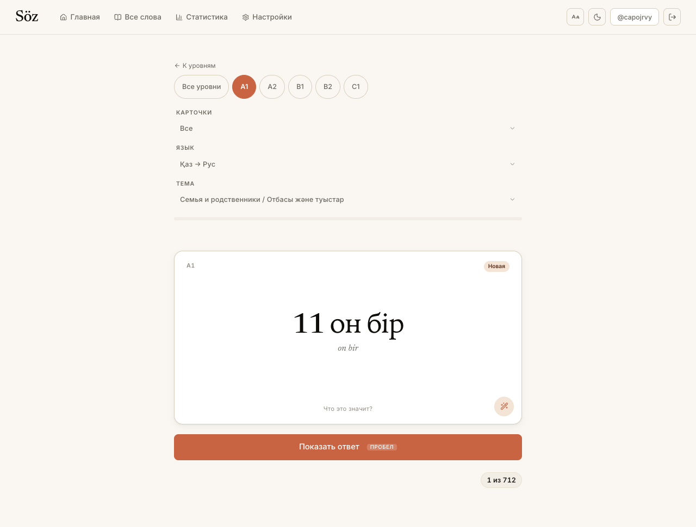
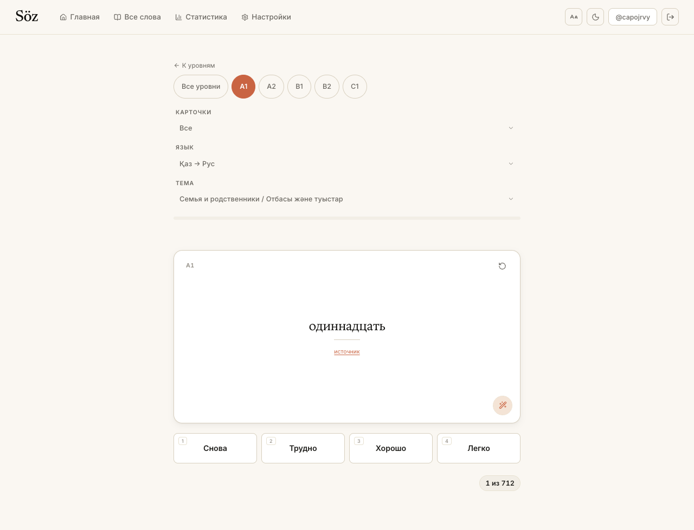

# Қазақ Anki — Spaced-Repetition Flashcards for Kazakh

A free, self-hosted web app for learning **Қазақ тілі** (Kazakh) with **Anki-style spaced repetition**. 3,996 words across the five CEFR levels A1, A2, B1, B2, C1.

> Modern TypeScript stack · React 19 · Vite 6 · SM-2 algorithm · bcrypt auth · SQLite · **164 KB gzipped** for the first screenful (HTML + JS + CSS, measured against the production build). Type is self-hosted: the two preloaded Cyrillic faces cost 80 KB, and a Kazakh card pulls two more Cyrillic-Ext slices — another 56 KB for Ә Ғ Қ Ң Ө Ұ Ү Һ. 7,473 pronunciation clips ship as lossless FLAC — 168 MB, down from 300 MB as WAV, with the audio fetched one word at a time.

---

## Features

- **3,996 words** organized by CEFR level (A1 → C1) and topic. Sourced from the [Qazcorpus school lexicon](https://qazcorpus.kz/_oqu-ishorpus/Sauattik/); per-card provenance and licensing live in [`src/data/SOURCES.md`](src/data/SOURCES.md).
- **SM-2 spaced repetition** with four rating buttons: *Again / Hard / Good / Easy*, plus keyboard shortcuts (1/2/3/4 and Space).
- **Per-user accounts** with bcrypt-hashed passwords. Each username is its own data island.
- **Self-hosted, single-user.** Accounts and progress live in a SQLite file on your own machine; nothing goes to a third party. The browser's `localStorage` holds only a session token and your display preferences.
- **Light + dark theme**, responsive, accessible (keyboard, reduced-motion, focus styles).
- **Browse every card** with search and level filters.
- **Stats page** with accuracy, mastery, level mastery rings and per-topic progress.
- **Runs with Docker** — `docker compose up -d --build` brings up the API, the web container and TTS together on `http://localhost:8080`. See **[DEPLOY.md](DEPLOY.md)**.

---

## Screenshots







The full gallery (mobile, dark mode, every route) lives in
[`docs/screenshots/`](docs/screenshots/README.md).

---

## Quick start

The app needs an API. Accounts and progress are server-side, so `npm run dev`
on its own gives you a UI that cannot register anyone.

```bash
npm install
npm run server     # API on http://localhost:3001 — leave this running
npm run dev        # app on http://localhost:5173/
```

The dev server proxies `/api/*` to the API, so there is nothing to configure.

Or let Docker do it, which also starts TTS:

```bash
docker compose up -d --build    # → http://localhost:8080
```

Build for production:

```bash
npm run build      # → dist/ (still needs an API at runtime)
npm run preview    # serve dist/ locally
npm run deploy     # publish landing/ to the gh-pages branch
npm run deploy:app # build dist/ and publish it to gh-pages
```

---

## Deploying to GitHub Pages

**GitHub Pages hosts the landing page, not the app.** The two are
different surfaces and only one of them is static.

The app needs an API: accounts are created through Express, and progress
lives server-side behind that account. A static host can serve the
bundle but not the server it calls, so a Pages deploy of `dist/` is a
site where registration simply does not work. The landing in `landing/`
is a static page that says so and gives you the two commands that bring
the real thing up on your own machine.

| Command | Publishes | Use it for |
|---|---|---|
| `npm run deploy` | `landing/` → `gh-pages` | the default — the landing page |
| `npm run deploy:app` | `dist/` → `gh-pages` | only if you host an API and want the bundle in front of it |

Both need the `gh-pages` branch flow:

1. Push this repo to GitHub (default branch: `main`).
2. In your repo settings → **Pages** → Source: the **`gh-pages` branch**
   (created by whichever command you run).
3. Deploy:

   ```bash
   npm run deploy
   ```

To run the app itself, see **[DEPLOY.md](DEPLOY.md)** — `docker compose up`
brings up the API, the web container, TTS and backups together.

<details>
<summary>GitHub Actions alternative</summary>

If you deploy the landing through **GitHub Actions** instead, the workflow
needs no build step at all — `landing/` is already the published output:

```yaml
name: Deploy landing to GitHub Pages
on:
  push:
    branches: [main]
    paths: ['landing/**']
permissions:
  contents: read
  pages: write
  id-token: write
jobs:
  deploy:
    runs-on: ubuntu-latest
    environment:
      name: github-pages
    steps:
      - uses: actions/checkout@v4
      - uses: actions/configure-pages@v5
      - uses: actions/upload-pages-artifact@v3
        with:
          path: landing
```

</details>

<details>
<summary>Old: deploying the app bundle to Pages (only if you also host an API)</summary>

1. Push this repo to GitHub (default branch: `main`).
2. In your repo settings → **Pages** → Source: **GitHub Actions** (recommended) or the **`gh-pages` branch** (created by `npm run deploy:app`).
3. If using the **`gh-pages` branch** flow, just run:

   ```bash
   npm run deploy:app
   ```

   Builds `dist/` and pushes it to a `gh-pages` branch.

4. If using **GitHub Actions**, drop in the workflow below at `.github/workflows/deploy.yml`:

   ```yaml
   name: Deploy to GitHub Pages
   on:
     push:
       branches: [main]
   permissions:
     contents: read
     pages: write
     id-token: write
   jobs:
     build-deploy:
       runs-on: ubuntu-latest
       environment:
         name: github-pages
         url: ${{ steps.deploy.outputs.page_url }}
       steps:
         - uses: actions/checkout@v4
         - uses: actions/setup-node@v4
           with: { node-version: 20, cache: npm }
         - run: npm ci
         - run: npm run build
         - uses: actions/configure-pages@v5
         - uses: actions/upload-pages-artifact@v3
           with: { path: dist }
         - id: deploy
           uses: actions/deploy-pages@v4
   ```

> The `/qazaq-anki/` base is the repo name baked into the production build. To change it, set `VITE_BASE` — that is the override `vite.config.ts` reads — rather than editing the file, or the next build will disagree with you.

### Custom domain

Build with `VITE_BASE=/ npm run build` (or `npm run build:pages` with the variable overridden) so assets resolve at the domain root, add a `CNAME` file in `public/` containing your domain, then deploy.

---

## How learning works

A study session pulls cards that are *due* (interval expired or brand new) from the chosen CEFR level. For each card:

1. The Kazakh word + transliteration shows.
2. Click the card (or press **Space**) to flip and reveal the Russian meaning.
3. Rate yourself: **Again / Hard / Good / Easy** (or `1`/`2`/`3`/`4`).
4. SM-2 schedules the next review — usually in 1 day, 6 days, or `previous × ease`, with the ease factor adjusting to your performance.

Tap **All** in the study tabs to drill every card in the level regardless of due state.

---

## A note on auth

Auth is server-side. The API hashes passwords with bcrypt (10 rounds) and keeps
the result in the `users` table, so the browser never holds a hash it could
replay. On login or registration the server mints an opaque session token,
stores it in the `sessions` table and hands it back; the client sends it as
`Authorization: Bearer <token>` on every request. That token is the one piece
of session state the browser persists, in `localStorage` under `aq:token` —
alongside `aq:theme`, `aq:fontSize` and `aq:ttsSpeed`. Those four keys are the
entire local footprint: even the "have I seen this tour" flags live on the
server (`users.onboardingSeen`), with no localStorage copy behind them.

Progress is not in the browser at all. `ProgressContext` reads it from the API
on load and writes it back through the review endpoints, so clearing site data
costs you a re-login rather than your history.

Single-user and self-hosted is a deliberate scope, but the trust boundary is
then the machine the server runs on — don't put anything in it you'd mind
losing. You can reset your progress at any time from the **Stats** page.

---

## Project structure

```
server/               # Express API — plain ESM, no build step
  server.js           # routes
  auth.js             # register / login / sessions / password change
  db.js               # sql.js (SQLite via WASM) + schema + migrations
  cards.js            # user-added cards
  ratelimit.js        # in-memory fixed-window limiter
  apkg.js             # Anki package import/export
src/                  # React front-end
  data/
    decks.json        # manifest: 5 levels, topics, cardCount
    decks/            # the cards themselves, one file per level
      a1.json         #   712 · a2 693 · b1 1,559 · b2 449 · c1 583
    decks.ts          # Card type + lazy loadLevel()
    SOURCES.md        # per-card provenance, licensing, regeneration
  lib/
    sm2.ts            # spaced-repetition algorithm
    auth.ts           # domain types + shared validation
    api.ts            # the only module that talks to the server
    storage.ts        # localStorage wrapper with an in-memory fallback
    progress.ts       # per-card schedule types
  contexts/           # auth, progress, theme, font size, language, onboarding
  components/         # Layout, Flashcard, modals, pickers, skeleton
  pages/              # Home, Login, Register, Decks, Study, Browse, Stats, Settings
  styles/
    global.css        # design tokens + base
    fonts.css         # self-hosted @font-face, one rule per subset
e2e/                  # Playwright specs
scripts/              # deck build, TTS, font tooling
```

Each level is a lazy `import()`, so Vite splits the bundle per level and you
only download the deck you actually open.

### Refreshing the deck data

The cards were parsed from the Qazcorpus school-lexicon PDFs. To re-generate:

```bash
mkdir -p /tmp/lexmin                        # then put lexmin_A1.pdf … lexmin_C1.pdf there
node scripts/build-lexmin.mjs /tmp/lexmin   # → src/data/decks/{a1..c1}.json
node scripts/unify-topics.mjs               # unify topics, drop cross-level duplicates
npm test                                    # decks.test.ts pins the counts
```

Full details, including the per-source attribution rules, are in
[`src/data/SOURCES.md`](src/data/SOURCES.md). To add a card by hand, edit the
level file and bump its `cardCount` in `decks.json`.

---

## Keyboard shortcuts (in study mode)

| Key             | Action                |
|-----------------|-----------------------|
| `Space` / `Enter` | Reveal the answer    |
| `1`             | Again (≤ 1d)          |
| `2`             | Hard                  |
| `3`             | Good                  |
| `4`             | Easy                  |

---

## Credits

- Vocabulary: [Qazcorpus — school lexicon, CEFR A1–C1](https://qazcorpus.kz/_oqu-ishorpus/Sauattik/), used as an educational source. Per-card provenance in [`src/data/SOURCES.md`](src/data/SOURCES.md).
- Spaced repetition: SM-2 algorithm (Wozniak, 1990).
- Design tokens: `src/styles/global.css`.

---

## License

MIT — do whatever you want, just don't claim you made it.
